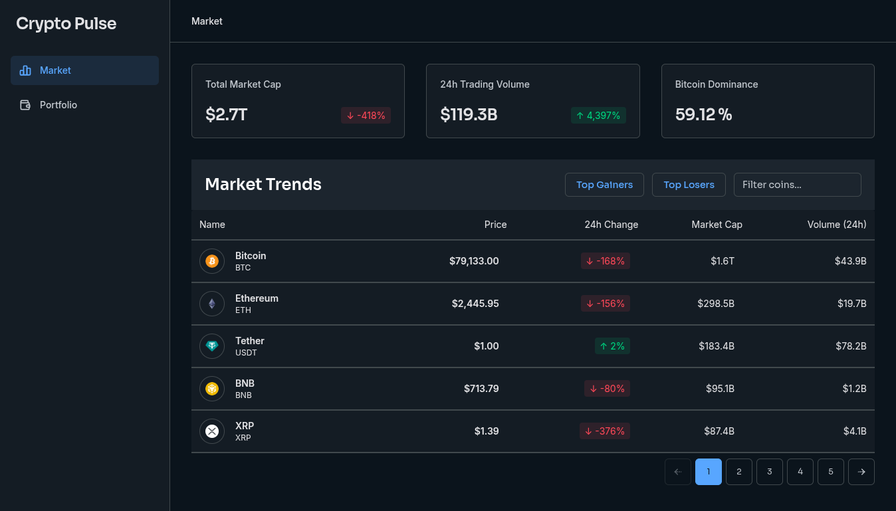

# CryptoPulse

A clean cryptocurrency dashboard built with Angular. It lets you browse the market, inspect coin details and track a portfolio from one place.

Market data is provided by the [CoinGecko API](https://www.coingecko.com/en/api).



## Features

- Market overview with global metrics and a paginated coin list
- Coin detail pages with price charts and key statistics
- Portfolio section
- Loading skeletons for a smoother experience
- Responsive layout with breadcrumbs and sidebar navigation

## Angular 22

CryptoPulse takes advantage of modern Angular APIs and patterns introduced in recent Angular versions:

- Signals for reactive local and feature state
- Computed signals for derived state
- Effects for reacting to signal changes when needed
- httpResource for reactive HTTP data fetching
- Signal Forms for type-safe, signal-based form management and validation
- Signal-based viewChild queries
- inject() for dependency injection
- Route input binding to pass route parameters directly into components

The project follows Angular's modern signal-first approach, keeping components reactive while avoiding unnecessary state management complexity.

## Tech stack

- Angular 22
- TypeScript
- Tailwind CSS
- Angular Signals and RxJS
- Lightweight Charts
- Vitest
- ESLint
- pnpm

## Project structure

The project follows a **feature-based** structure. Code that belongs to one user-facing area stays together, making it easier to find, change and scale.

```text
src/app/
├── core/        # App-wide services, API clients and shared data models
├── features/    # Product areas: market, coin detail and portfolio
├── layout/      # Main layout, sidebar and breadcrumbs
└── shared/      # Reusable UI components, icons and pipes
```

Each feature can contain its page, feature-specific components, state services and models when needed. Shared code is only moved to `shared` or `core` when it is useful across more than one feature.

## Getting started

### Requirements

- Node.js
- pnpm 11 or later

### Install and run

```bash
pnpm install
pnpm start
```

Open `http://localhost:4200` in your browser.

## Available commands

```bash
pnpm start   # Start the development server
pnpm build   # Create a production build
pnpm test    # Run unit tests
pnpm lint    # Check the code with ESLint
```

## Data source

Crypto prices, market information and chart data come from the public CoinGecko API. API requests are kept in `src/app/core/services/coin-gecko-api.ts` so UI components stay focused on presentation.
